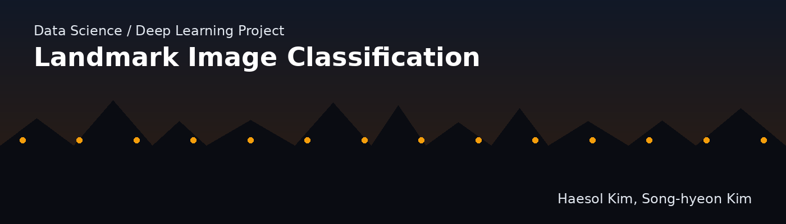

> The original thumbnail was a photo with Korean title text overlaid on it. Since that exact photo isn't available to edit, a new original English banner was created for this repository instead.


## 📋 Introduction
I used deep learning on a public dataset to attempt image classification.

## Data Collection
Landmark images were chosen as the image category for the following reasons:
- The location information of a photo can be pinned down more precisely.
- It can be used to automatically tag photos with landmark hashtags when uploaded to social media.

The data was downloaded from AI Hub.

[AI Hub - Landmark Images](https://www.aihub.or.kr/aihubdata/data/view.do?currMenu=115&topMenu=100&aihubDataSe=realm&dataSetSn=56) *(Korean source)*

The full dataset is 12TB, which is too large to work with for training, so I used only the data for Sejong City, the smallest regional unit available.

- 48 GB total
- Image size: 4032 x 3024
- Classes: 84
- Split into training (12,396 images) and validation (1,504 images) sets

> **Note on images below:** the result/chart images in this section are the original screenshots produced when the notebook was run. Regenerating them in English would require re-running the full training pipeline against the original landmark image dataset (48GB, not included in this repository). The surrounding text has been fully translated to explain what each image shows.

## 🎯 Results

|Accuracy|PyTorch|ResNet50|
|---|------|---|
|Train|99.85%|99.42%|
|Validation|85.17%|96.68%|


Some images, such as those of Confucian schools (hyanggyo) and academies (seowon), were not classified well.


## Preprocessing
### Preparation
Since uploading the collected data to Google Colab was impractical, I used OpenCV on a local machine to resize the images down to 0.1x their original size.
```python
import cv2

img = cv2.imread(os.path.join(region_dir, cls, fname))
resized_img = cv2.resize(img, (0, 0), fx=0.1, fy=0.1, interpolation=cv2.INTER_AREA)
cv2.imwrite(os.path.join(target_dir, fname), resized_img)
```

### Transform
#### Resize
To measure how accuracy changes with resize dimensions, I ran the pipeline with each of the following three sizes:
- 256x256, 128x128, 64x64

#### Normalize
Using ImageNet's mean and std values would have worked fine, but to push accuracy a bit further I computed the dataset's own normalization values with the function below.
```python
def get_mean_and_std(dataloader):
    channels_sum, channels_squared_sum, num_batches = 0, 0, 0
    for data, _ in dataloader:
        # Mean over batch, height and width, but not over the channels
        channels_sum += torch.mean(data, dim=[0,2,3])
        channels_squared_sum += torch.mean(data**2, dim=[0,2,3])
        num_batches += 1
    
    mean = channels_sum / num_batches

    # std = sqrt(E[X^2] - (E[X])^2)
    std = (channels_squared_sum / num_batches - mean ** 2) ** 0.5

    return mean, std
```

### Dataset & DataLoader

|Dataset & DataLoader|Description|
|------|---|
|Indexing directly, like a list|Can be written by hand; it seems to read and train on large batches of image files as needed rather than loading them all into memory at once|
|Iterating via DataLoader|Used inside the training `for` loop; implemented as a generator that fetches a batch-sized chunk of data on each iteration|

I used `ImageFolder` together with `DataLoader`.
- The folder structure was already organized in a way that made `ImageFolder` easy to use.

```python
image_datasets = {x: ImageFolder(root=os.path.join(data_dir, x),
                                 transform=transform[x]) for x in transform.keys()}
dataloaders = {x: DataLoader(image_datasets[x],
                             batch_size=BATCH_SIZE,
                             shuffle=True,
                             num_workers=2) for x in transform.keys()}
```

## 🔎 Modeling
### Transfer Learning
I planned to use transfer learning with ResNet50 (`requires_grad = False` applied up through `conv3_x`).


#### Why ResNet50
1. It significantly lowers the difficulty of training.
2. Accuracy tends to improve as depth increases.
3. It mitigates the problems that arise in CNNs when stacking many layers to design very deep networks.

### Sweeps (Weights & Biases)
Since W&B supports web-based result visualization, I used Sweeps to visualize accuracy and the loss function.

### Optimizer
I used Adam.

### Scheduler
Configured to decay by a factor of 0.1 every 7 epochs.
```python
# Decay LR by a factor of 0.1 every 7 epochs
exp_lr_scheduler = lr_scheduler.StepLR(optimizer_ft, step_size=7, gamma=0.1)
```

## Performance Improvement
To find the optimal hyperparameters, I used Weights & Biases' Sweeps feature to repeatedly run the pipeline while varying several parameters.

[Hyperparameter-Sweeps](https://wandb.ai/zbooster/Hyperparameter-Sweeps?workspace=user-zbooster)

## ⚙️ Open Question
While running epochs, I observed cases where training accuracy reached 100%.
- Whenever accuracy hits 100%, the data itself should be questioned.
  - I plan to check whether narrowing the dataset down to Sejong City introduced any overfitting.

## 📖 References
- Kaiming He et al., Microsoft Research (2015), *Deep Residual Learning for Image Recognition*
  - https://arxiv.org/pdf/1512.03385.pdf
- Aroddary, AI researcher — Korean translation, additional explanation, and Keras implementation of *(ResNet) Deep Residual Learning for Image Recognition*
  - https://sike6054.github.io/blog/paper/first-post/ *(Korean source)*

## 🤲 Team
|Member|Contact|
|------|---|
|Song-hyeon Kim|[Email](mailto:zpaladin1213@gmail.com) │ [Velog](https://velog.io/@zbooster)|
|Haesol Kim|[Email](mailto:lunchtime99@gmail.com) │ [Velog](https://velog.io/@kim_haesol)|

## About This Repository
This English repository includes the README and the two main notebooks (`preprocessing.ipynb`, `model_training.ipynb`), translated to English.
The `backup/` folder (exploratory/scratch notebooks) was intentionally left out to keep this translated repo focused on the final pipeline. For the complete experiment history, see the original repository linked below.

---
*This is an English translation of the original Korean-language project. Original repository: [haesol97/Landmark-Image-Classification](https://github.com/haesol97/Landmark-Image-Classification)*
